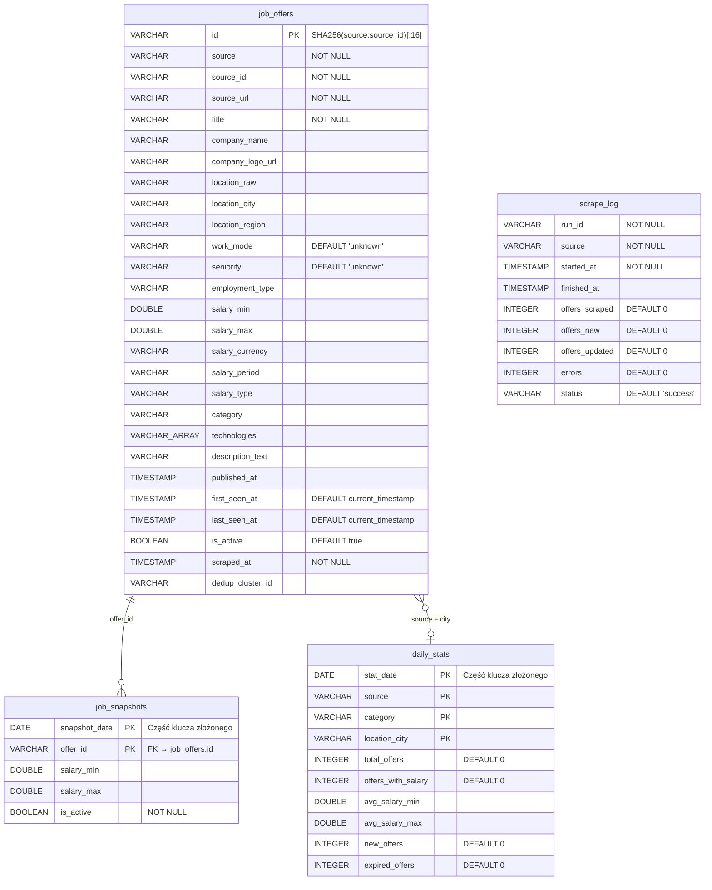
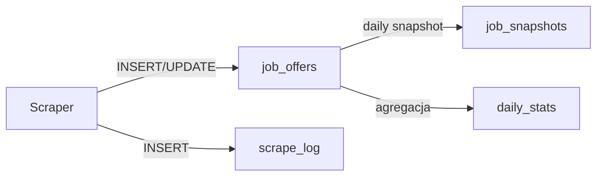

# Schemat bazy danych — jobDB

Baza danych: **MySQL** (`localhost:3306/jobdb`)

---

## Diagram relacji (ERD)



---

## Tabele

### 1. `job_offers` — główna tabela ofert pracy

Przechowuje wszystkie zebrane oferty pracy ze wszystkich źródeł.

| Kolumna | Typ | Constraints | Opis |
|---|---|---|---|
| `id` | `VARCHAR` | **PRIMARY KEY** | Hash SHA256 ze `source:source_id`, obcięty do 16 znaków |
| `source` | `VARCHAR` | `NOT NULL` | Identyfikator źródła (enum `Source`) |
| `source_id` | `VARCHAR` | `NOT NULL` | Unikalny ID oferty w źródle |
| `source_url` | `VARCHAR` | `NOT NULL` | Pełny URL oferty w serwisie źródłowym |
| `title` | `VARCHAR` | `NOT NULL` | Tytuł stanowiska |
| `company_name` | `VARCHAR` | | Nazwa pracodawcy |
| `company_logo_url` | `VARCHAR` | | URL logo firmy (ładowane z zewnętrznego serwera) |
| `location_raw` | `VARCHAR` | | Surowa lokalizacja z ogłoszenia |
| `location_city` | `VARCHAR` | | Znormalizowana nazwa miasta |
| `location_region` | `VARCHAR` | | Województwo (uzupełniane przez normalizer) |
| `work_mode` | `VARCHAR` | `DEFAULT 'unknown'` | Tryb pracy: `remote` / `hybrid` / `onsite` / `unknown` |
| `seniority` | `VARCHAR` | `DEFAULT 'unknown'` | Poziom doświadczenia (enum `Seniority`) |
| `employment_type` | `VARCHAR` | | Forma zatrudnienia: `UoP` / `B2B` / `UZ` |
| `salary_min` | `DOUBLE` | | Dolna granica widełek wynagrodzenia |
| `salary_max` | `DOUBLE` | | Górna granica widełek wynagrodzenia |
| `salary_currency` | `VARCHAR` | | Waluta: `PLN` / `EUR` / `USD` / `GBP` / `CHF` |
| `salary_period` | `VARCHAR` | | Okres rozliczeniowy: `month` / `hour` / `day` / `year` |
| `salary_type` | `VARCHAR` | | Typ wynagrodzenia: `brutto` / `netto` |
| `category` | `VARCHAR` | | Kategoria branżowa oferty |
| `technologies` | `JSON` | | Lista technologii/wymagań (tablica JSON) |
| `description_text` | `VARCHAR` | | Pełny tekst opisu ogłoszenia |
| `published_at` | `TIMESTAMP` | | Data publikacji ogłoszenia |
| `first_seen_at` | `TIMESTAMP` | `NOT NULL DEFAULT current_timestamp` | Kiedy oferta została po raz pierwszy zescrapowana |
| `last_seen_at` | `TIMESTAMP` | `NOT NULL DEFAULT current_timestamp` | Kiedy oferta była ostatnio widoczna na portalu |
| `is_active` | `BOOLEAN` | `DEFAULT true` | Czy oferta jest nadal aktywna |
| `scraped_at` | `TIMESTAMP` | `NOT NULL` | Timestamp ostatniego scrapowania |
| `dedup_cluster_id` | `VARCHAR` | | ID klastra deduplikacji (grupuje tę samą ofertę z różnych źródeł) |

**Klucz unikalny:** `UNIQUE (source, source_id)` — jedna oferta na źródło.

---

### 2. `job_snapshots` — snapshoty ofert (time-series)

Dzienne migawki aktywnych ofert do analizy trendów i zmian wynagrodzeń w czasie.

| Kolumna | Typ | Constraints | Opis |
|---|---|---|---|
| `snapshot_date` | `DATE` | **PK** (część klucza złożonego) | Data snapshotu |
| `offer_id` | `VARCHAR` | **PK** (część klucza złożonego) | Referencja do `job_offers.id` |
| `salary_min` | `DOUBLE` | | Wynagrodzenie min w momencie snapshotu |
| `salary_max` | `DOUBLE` | | Wynagrodzenie max w momencie snapshotu |
| `is_active` | `BOOLEAN` | `NOT NULL` | Czy oferta była aktywna w dniu snapshotu |

**Klucz główny:** `PRIMARY KEY (snapshot_date, offer_id)`

**Relacja:** `offer_id` → `job_offers.id` (logiczny FK)

---

### 3. `daily_stats` — zagregowane statystyki dzienne

Preaggregowane statystyki dla szybkich zapytań dashboardowych i analizy trendów.

| Kolumna | Typ | Constraints | Opis |
|---|---|---|---|
| `stat_date` | `DATE` | **PK** (część klucza złożonego) | Data statystyki |
| `source` | `VARCHAR` | **PK** | Źródło danych |
| `category` | `VARCHAR` | **PK** | Kategoria branżowa |
| `location_city` | `VARCHAR` | **PK** | Miasto |
| `total_offers` | `INTEGER` | `DEFAULT 0` | Łączna liczba ofert |
| `offers_with_salary` | `INTEGER` | `DEFAULT 0` | Liczba ofert z podanym wynagrodzeniem |
| `avg_salary_min` | `DOUBLE` | | Średnia dolna granica wynagrodzeń |
| `avg_salary_max` | `DOUBLE` | | Średnia górna granica wynagrodzeń |
| `new_offers` | `INTEGER` | `DEFAULT 0` | Nowe oferty w danym dniu |
| `expired_offers` | `INTEGER` | `DEFAULT 0` | Oferty wygasłe w danym dniu |

**Klucz główny:** `PRIMARY KEY (stat_date, source, category, location_city)`

---

### 4. `scrape_log` — log uruchomień scrapera

Tabela audytowa rejestrująca każde uruchomienie scrapera.

| Kolumna | Typ | Constraints | Opis |
|---|---|---|---|
| `run_id` | `VARCHAR` | `NOT NULL` | UUID uruchomienia (pierwsze 12 znaków) |
| `source` | `VARCHAR` | `NOT NULL` | Źródło, które było scrapowane |
| `started_at` | `TIMESTAMP` | `NOT NULL` | Początek uruchomienia |
| `finished_at` | `TIMESTAMP` | | Koniec uruchomienia |
| `offers_scraped` | `INTEGER` | `DEFAULT 0` | Liczba zescrapowanych ofert |
| `offers_new` | `INTEGER` | `DEFAULT 0` | Nowe oferty (INSERT) |
| `offers_updated` | `INTEGER` | `DEFAULT 0` | Zaktualizowane oferty (UPDATE) |
| `errors` | `INTEGER` | `DEFAULT 0` | Liczba błędów |
| `status` | `VARCHAR` | `DEFAULT 'success'` | Status: `success` / `partial` / `failed` |

**Brak klucza głównego** — tabela logowa, może mieć wiele wpisów na `run_id` (po jednym per source).

---

## Wartości dozwolone (Enumy)

Definiowane w `src/models/schema.py` jako `str, Enum`:

### `Source` — źródła danych
| Wartość | Portal |
|---|---|
| `pracapl` | praca.pl |
| `justjoinit` | justjoin.it |
| `rocketjobs` | rocketjobs.pl |
| `pracuj` | pracuj.pl |
| `nofluffjobs` | nofluffjobs.com |
| `jooble` | jooble.org |

### `WorkMode` — tryb pracy
| Wartość | Opis |
|---|---|
| `remote` | Praca zdalna |
| `hybrid` | Praca hybrydowa |
| `onsite` | Praca stacjonarna |
| `unknown` | Nieokreślony |

### `Seniority` — poziom doświadczenia
| Wartość | Opis |
|---|---|
| `intern` | Stażysta / Praktykant |
| `junior` | Junior |
| `mid` | Mid / Specjalista |
| `senior` | Senior |
| `lead` | Lead / Principal |
| `manager` | Kierownik / Manager |
| `unknown` | Nieokreślony |

### `SalaryPeriod` — okres rozliczeniowy
| Wartość | Opis |
|---|---|
| `month` | Miesięcznie |
| `hour` | Godzinowo |
| `day` | Dziennie |
| `year` | Rocznie |

### `ScrapeStatus` — status uruchomienia
| Wartość | Opis |
|---|---|
| `success` | Sukces — wszystkie strony zescrapowane |
| `partial` | Częściowy sukces — część stron z błędami |
| `failed` | Błąd — scrapowanie nie powiodło się |

---

## Generowanie ID oferty

```
id = SHA256("source:source_id")[:16]
```

Przykład:
```
source = "pracapl", source_id = "10779866"
→ SHA256("pracapl:10779866") → "a3f8b2c1e9d04f71"
```

Skrócenie do 16 znaków zapewnia unikalność przy rozsądnym rozmiarze klucza.

---

## Przepływ danych w schemacie



1. **Scraper** → `job_offers` (upsert po `source + source_id`) + `scrape_log` (INSERT)
2. **Snapshot** → `job_snapshots` (dzienne kopiowanie aktywnych ofert z salary)
3. **Agregacja** → `daily_stats` (obliczanie średnich, sum per data/źródło/miasto)
