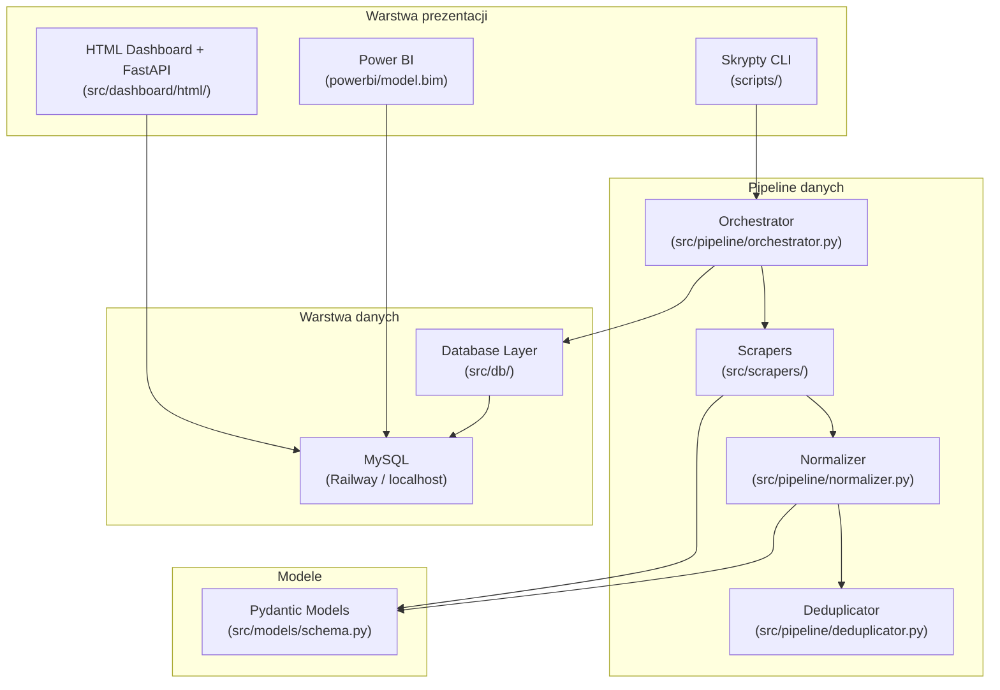
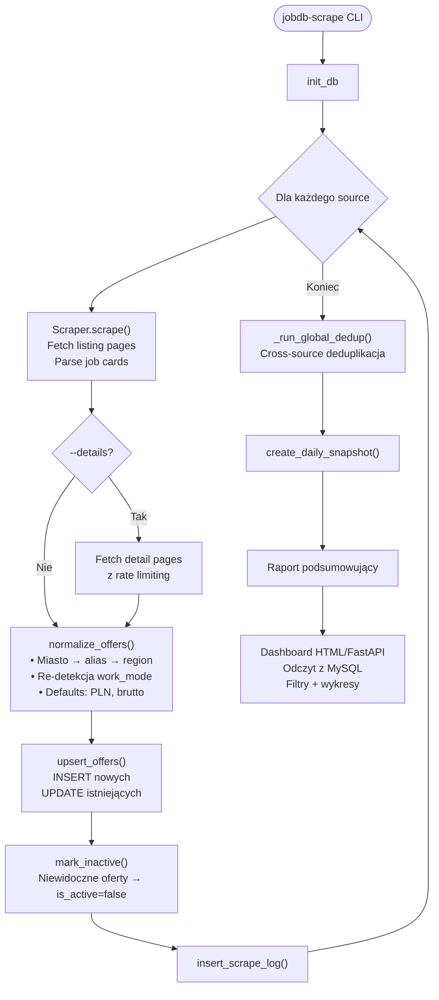

# Projekt systemu — jobDB

**jobDB** — tracker rynku pracy w stylu SteamDB dla polskich portali z ofertami pracy.
System scrapuje oferty, normalizuje dane, przechowuje je w MySQL i prezentuje w dashboardzie HTML/FastAPI oraz Power BI.

**Deploy:** Railway (Docker + FastAPI + uvicorn)

---

## Architektura



---

## Stos technologiczny

| Warstwa | Technologie |
|---|---|
| Scraping | `httpx[http2]`, `selectolax` (HTML parsing), `playwright` (pracuj.pl, jooble) |
| Modele danych | `pydantic` v2 (walidacja, computed fields) |
| Baza danych | `mysql-connector-python` (MySQL 8+), env vars |
| Pipeline | `tenacity` (retry), `rapidfuzz` (fuzzy matching, deduplikacja) |
| Dashboard | `fastapi`, `uvicorn`, Chart.js (frontend) |
| BI | Power BI (model.bim, DAX measures) |
| CLI / UX | `rich` (formatowanie terminala), `argparse` |
| Scheduler | `schedule` + Windows Task Scheduler (`scripts/schedule_scraper.py`) |
| Logging | Python `logging` — plik + konsola, rotacja 30 plików (`data/logs/`) |
| Testy | `pytest`, `pytest-asyncio` |
| Linter | `ruff` (reguły E/F/I/N/W, max 120 znaków) |
| Deploy | Docker + Railway |

---

## Moduły

### 1. Scrapers (`src/scrapers/`)

#### `base.py` — BaseScraper (klasa abstrakcyjna)

Bazowa klasa dla wszystkich scraperów z wbudowaną odpornością na błędy:

- **HTTP Client**: `httpx` z HTTP/2, timeout 30s
- **Retry**: Do 3 prób z wykładniczym backoffem (2–30s)
- **User-Agent Rotation**: Losowy nagłówek z puli 3 przeglądarek (Chrome/Firefox/Edge)
- **Rate Limiting**: Konfigurowalne opóźnienie per scraper z jitterem ×0.5–1.5
- **Metody abstrakcyjne**:
  - `scrape_listings(page)` → `list[JobOffer]` — parsowanie strony z listingiem
  - `scrape_detail(offer)` → `JobOffer` — opcjonalne wzbogacenie z podstrony
- **Metoda `scrape()`**: Pełna orkiestracja — iteracja po stronach, zbieranie ofert, obsługa błędów → `ScrapedResult`

#### `pracapl.py` — PracaPLScraper (praca.pl)

Scraper HTML-owy:

**Parsowanie listingu:**
1. Selektor CSS: `ul.listing:not(.listing--week-offer) li.listing__item`
2. Fallback regex: `_(\d{7,10})\.html` na wszystkich linkach

**Ekstrakcja z karty oferty:**
- Tytuł + source_id → `<a class="listing__title">`
- Firma → `<a class="listing__employer-name">`
- Lokalizacja → `<span class="listing__location-name">` (oczyszczana z tekstu trybu pracy)
- Tryb pracy → `<span class="listing__work-model">` (zdalna→remote, hybrydow→hybrid, stacjonarn→onsite)
- Seniority → detekcja po słowach kluczowych (staż/praktyk→intern, junior, senior, lead, kierowni→manager, specjalist→mid)
- Wynagrodzenie → `_parse_salary(text)`

**Parser wynagrodzeń (`_parse_salary`):**
- Obsługuje formaty polskie: `"12 500 - 14 500 zł brutto/mies"`, `"30-45 €/godz"`
- Spacje w tysiącach, przecinki jako separator dziesiętny, NBSP
- Detekcja waluty: PLN (domyślna), EUR (€), USD ($), GBP (£), CHF
- Detekcja okresu: /mies→month, /godz→hour, /dzień→day, /rok→year
- Detekcja typu: brutto (domyślny) / netto (+ "na rękę")

**Wzbogacenie z podstrony (opcjonalne):**
- Pełny opis ogłoszenia
- Uzupełnienie firmy/lokalizacji jeśli brakuje na listing

**Rejestr scraperów:**
```python
SCRAPER_REGISTRY = {
    Source.PRACAPL: PracaPLScraper,
    Source.PRACUJ: PracujPLScraper,
    Source.JUSTJOINIT: JustJoinITScraper,
    Source.ROCKETJOBS: RocketJobsScraper,
    Source.NOFLUFFJOBS: NoFluffJobsScraper,
    # Jooble disabled — aggregator that duplicates offers from primary sources
}
```

#### `pracujpl.py` — PracujPLScraper (pracuj.pl)

Scraper oparty na Playwright (Next.js, blokuje plain HTTP):
- Renderowanie stron JS w headless browser
- Detekcja duplikatów stron i filtrowanie ofert testowych

#### `justjoinit.py` — JustJoinITScraper (justjoin.it)

Scraper API-owy (dziedziczy z `_justjoin_base.py`):
- Pobiera oferty przez REST API justjoin.it

#### `rocketjobs.py` — RocketJobsScraper (rocketjobs.pl)

Scraper API-owy (dziedziczy z `_justjoin_base.py`):
- Wspólna baza z justjoin.it (ten sam backend API)

#### `nofluffjobs.py` — NoFluffJobsScraper (nofluffjobs.com)

Scraper API-owy:
- Pobiera wszystkie oferty w jednym requeście

#### `jooble.py` — JoobleScraper (jooble.org) — WYŁĄCZONY

Scraper Playwright-owy — celowo wyłączony z SCRAPER_REGISTRY (agregator duplikujący oferty z innych źródeł).

---

### 2. Pipeline (`src/pipeline/`)

#### `orchestrator.py` — główny przepływ

```
run_pipeline(sources, max_pages, fetch_details) → dict[Source, ScrapeLogEntry]
```

**Kroki:**
1. Inicjalizacja bazy (`init_db()`)
2. Dla każdego źródła:
   - Instancja scrapera z rejestru → `scraper.scrape()` → `ScrapedResult`
   - (Opcjonalnie) Fetch detail pages z rate limitingiem
   - Normalizacja → `normalize_offers(offers)`
   - Zapis → `upsert_offers(offers)` (INSERT nowych / UPDATE istniejących)
   - Oznaczenie nieaktywnych → `mark_inactive(source, active_ids)`
   - Log → `insert_scrape_log(entry)`
3. Globalna deduplikacja cross-source (`_run_global_dedup()`) jeśli ≥2 źródła
4. Tworzenie daily snapshot (`create_daily_snapshot()`)
5. Wydruk raportu podsumowującego

**Run ID:** UUID (pierwsze 12 znaków) wiążące powiązane uruchomienia.

#### `normalizer.py` — normalizacja danych

- **Miasta**: 50+ aliasów polskich miast (warsaw→Warszawa, krakow→Kraków, zdalna→Remote)
- **Regiony**: Mapowanie miasto → województwo (Warszawa→mazowieckie, Kraków→małopolskie)
- **Tryb pracy**: Ponowna detekcja jeśli UNKNOWN — szukanie w title + location_raw + description
- **Tytuł/firma**: Kolaps wielokrotnych spacji
- **Wynagrodzenie**: Domyślna waluta PLN, domyślny typ brutto

#### `deduplicator.py` — deduplikacja ofert

- **Klucz prefiltracji**: MD5 hash `company_name|location_city` (pierwsze 10 znaków)
- **Sprawdzenie duplikatu** (`are_duplicates()`):
  - Różne źródła ✓
  - Fuzzy match firmy ≥ 70% (`rapidfuzz`)
  - Identyczne miasto
  - Podobieństwo tytułu (token-sort) ≥ 85%
- **Klasteryzacja**: Przypisanie `dedup_cluster_id` do dopasowanych ofert
- **Integracja**: Wywoływany w pipeline po upsert — globalna deduplikacja cross-source

---

### 3. Baza danych (`src/db/`)

#### `database.py` — zarządzanie połączeniem

- Singleton connection do MySQL (konfigurowalne przez env vars)
- Automatyczne tworzenie bazy jeśli nie istnieje (UTF-8, `utf8mb4_unicode_ci`)
- `get_connection()` / `close_connection()`

#### `migrations.py` — DDL

- `init_db()` — tworzy 4 tabele (idempotentne `CREATE TABLE IF NOT EXISTS`)
- `drop_all()` — kasuje wszystkie tabele (reset/testy)

#### `queries.py` — operacje na danych

| Funkcja | Opis |
|---|---|
| `upsert_offers(offers)` | INSERT nowych / UPDATE istniejących ofert → `(new_count, updated_count)` |
| `mark_inactive(source, active_ids)` | Oznacza oferty niewidoczne w tym uruchomieniu jako `is_active = false` |
| `insert_scrape_log(entry)` | Wstawia wpis do `scrape_log` |
| `create_daily_snapshot(date)` | Tworzy snapshot aktywnych ofert do `job_snapshots` |
| `get_offer_count(source?)` | Zlicza oferty (opcjonalnie per źródło) |
| `get_stats_summary()` | Podsumowanie: total / active / with_salary / sources / cities |

---

### 4. Modele danych (`src/models/schema.py`)

Modele Pydantic v2 z walidacją i computed fields:

| Model | Opis |
|---|---|
| `JobOffer` | Oferta pracy — 22 pola + computed `id` (SHA256) |
| `ScrapedResult` | Wynik uruchomienia scrapera — oferty + metryki |
| `ScrapeLogEntry` | Wpis do logu scrapowania |

Enumy: `Source`, `WorkMode`, `Seniority`, `SalaryPeriod`, `ScrapeStatus`

→ Szczegółowy opis w [DATABASE_SCHEMA.md](DATABASE_SCHEMA.md#wartości-dozwolone-enumy)

---

### 5. Dashboard (`src/dashboard/html/`)

Framework: **FastAPI** + **Chart.js** (REST API + SPA, read-only na MySQL)

**Filtry:**
- Multi-select: Źródło, Miasto, Tryb pracy, Seniority
- Checkbox: Tylko aktywne oferty

**Sekcje główne (6 stron SPA):**

| Strona | Zawartość |
|---|---|
| Executive Summary | KPI, źródła, seniority, tryb pracy, oferty wg dnia |
| Wynagrodzenia | Mediany, przedziały, rozkłady, porównania |
| Firmy | Top firmy, wielkość, lokalizacje |
| Lokalizacje | Top miasta, tryby pracy per miasto |
| Trendy | Nowe oferty/dzień, wzrost/spadek, aktywność źródeł |
| Jakość danych | Kompletność pól, pokrycie wynagrodzeń |

Wszystkie dane respektują aktywne filtry (dynamiczne WHERE).

---

### 6. Konfiguracja (`config/settings.py`)

```python
MYSQL_CONFIG = {
    "host": os.getenv("MYSQL_HOST", "localhost"),
    "port": int(os.getenv("MYSQL_PORT", "3306")),
    "user": os.getenv("MYSQL_USER", "root"),
    "password": os.getenv("MYSQL_PASSWORD", "root"),
    "database": os.getenv("MYSQL_DATABASE", "jobdb"),
}
EXPORTS_DIR = DATA_DIR / "exports"

DEFAULT_DELAY_SECONDS = 2.0
MAX_RETRIES = 3
REQUEST_TIMEOUT = 30

# Playwright settings
PLAYWRIGHT_GOTO_TIMEOUT = 60_000      # ms
PLAYWRIGHT_SELECTOR_TIMEOUT = 15_000  # ms
PLAYWRIGHT_MAX_RETRIES = 3
```

**Zdefiniowane źródła (5 aktywnych + 1 wyłączone):**

| Klucz | Portal | Base URL | Delay | Typ |
|---|---|---|---|---|
| `pracapl` | praca.pl | `https://www.praca.pl` | 2.0s | HTML |
| `justjoinit` | justjoin.it | `https://justjoin.it` | 1.5s | API |
| `rocketjobs` | rocketjobs.pl | `https://rocketjobs.pl` | 1.5s | API |
| `pracuj` | pracuj.pl | `https://www.pracuj.pl` | 3.0s | Playwright |
| `nofluffjobs` | nofluffjobs.com | `https://nofluffjobs.com` | 1.0s | API |
| ~~`jooble`~~ | ~~jooble.org~~ | ~~`https://pl.jooble.org`~~ | ~~2.5s~~ | ~~wyłączony~~ |

---

### 7. Skrypty CLI (`scripts/`)

| Skrypt | Entry Point | Opis |
|---|---|---|
| `run_scraper.py` | `jobdb-scrape` | Główny CLI — `-s` źródła, `-p` max stron, `-d` detale |
| `schedule_scraper.py` | — | Scheduler: Windows Task Scheduler (`--schedule`, `--unschedule`, `--status`) |
| `backup_db.py` | — | Backup mysqldump (auto/schedule, ostatnie 10) |
| `check_scraped_data.py` | — | Podsumowanie danych: counts, dystrybucje, statystyki salary |
| `verify_credibility.py` | — | Weryfikacja jakości danych vs live site |
| `compare_offers.py` | — | Ręczna weryfikacja ofert po ID |
| `verify_data.py` | — | Szybka weryfikacja kompletności danych |
| `verify_pracuj.py` | — | Weryfikacja danych pracuj.pl |
| `debug_html.py` | — | Inspekcja HTML — klasy CSS, struktury ofert |
| `debug_salary.py` | — | Debugowanie selektorów salary |
| `test_fixes.py` | — | Szybkie testy PracaPLScraper |

---

### 8. Testy (`tests/`)

**`test_salary_parsing.py`** — 26 test cases pytest:
- Formaty zakresowe: `"12 500 - 14 500 zł brutto/mies"`, `"4500-6000 zł"`
- Pojedyncze wartości: `"5 100 zł brutto/mies"`
- Godzinowe/dzienne/roczne: `"30-45 €/godz"`, `"350 zł brutto/dzień"`
- Multi-waluta: PLN, EUR (€), USD ($), GBP (£), CHF
- Edge cases: NBSP, B2B, decimals z przecinkami
- Wartości w złożonym tekście: `"pracownik fizyczny · umowa zlecenie · 12 500 - 14 500 zł..."`
- Nieprawidłowe dane: `None`, `""`, tekst bez salary

Status: **Wszystkie testy przechodzą ✅**

### 9. Agent progress-tracker (`.github/agents/progress-tracker.agent.md`)

Agent VS Code (Copilot) do weryfikacji i aktualizacji postępu prac:
- Porównuje deklarowany status w `docs/TODO.md` z faktycznym stanem kodu
- Uruchamia testy i sprawdza pokrycie
- Generuje raporty postępu z paskami procentowymi
- Wykrywa rozbieżności między dokumentacją a implementacją

### 10. Dashboard HTML (`src/dashboard/html/`)

SPA (Single Page Application) z REST API:
- **Backend**: FastAPI z endpointami odpowiadającymi 69 miarom DAX z Power BI
- **Frontend**: Vanilla JS + Chart.js, 6 stron nawigacyjnych
- **Deploy**: Railway (uvicorn)

---

---

## Przepływ danych end-to-end



---

## Struktura projektu

```
jobDB/
├── .github/
│   └── agents/
│       ├── data-verifier.agent.md   # Agent weryfikacji danych
│       └── progress-tracker.agent.md # Agent śledzenia postępu
├── config/
│   └── settings.py              # Konfiguracja: DB, źródła, delays, User-Agents
├── data/
│   └── debug_praca.html         # Testowy HTML praca.pl
├── docs/
│   ├── DATABASE_SCHEMA.md       # Schemat bazy danych
│   ├── PROJECT_DESIGN.md        # Ten plik
│   └── TODO.md                  # Lista rzeczy do zrobienia
├── scripts/
│   ├── run_scraper.py           # CLI: uruchomienie scrapowania
│   ├── check_scraped_data.py    # Podsumowanie zescrapowanych danych
│   ├── verify_data.py           # Weryfikacja kompletności
│   └── debug_html.py            # Debugowanie HTML
├── src/
│   ├── analysis/                # [PUSTY] Moduł analityczny
│   ├── dashboard/
│   │   ├── __init__.py
│   │   └── html/
│   │       ├── api.py               # FastAPI REST backend
│   │       ├── app.js               # SPA frontend (Chart.js)
│   │       ├── index.html           # HTML shell
│   │       └── style.css            # Style
│   ├── db/
│   │   ├── database.py          # Singleton MySQL connection (env vars)
│   │   ├── migrations.py        # DDL: CREATE/DROP tabel
│   │   └── queries.py           # Operacje: upsert, log, snapshot, mark_inactive
│   ├── models/
│   │   └── schema.py            # Modele Pydantic + enumy
│   ├── pipeline/
│   │   ├── orchestrator.py      # Główny przepływ pipeline
│   │   ├── normalizer.py        # Normalizacja danych
│   │   ├── deduplicator.py      # Deduplikacja cross-source
│   │   └── polish_cities.py     # Aliasy i regiony polskich miast
│   └── scrapers/
│       ├── base.py              # BaseScraper (klasa abstrakcyjna)
│       ├── _justjoin_base.py    # Baza dla justjoin.it + rocketjobs
│       ├── pracapl.py           # Scraper praca.pl (HTML)
│       ├── pracujpl.py          # Scraper pracuj.pl (Playwright)
│       ├── justjoinit.py        # Scraper justjoin.it (API)
│       ├── rocketjobs.py        # Scraper rocketjobs.pl (API)
│       ├── nofluffjobs.py       # Scraper nofluffjobs.com (API)
│       └── jooble.py            # Scraper jooble.org (wyłączony)
├── tests/
│   └── test_scrapers/
│       └── test_salary_parsing.py  # 26 testów parsowania salary
├── Dockerfile                   # Docker image (python:3.12-slim)
├── Procfile                     # Railway start command
├── railway.toml                 # Railway deploy config
└── pyproject.toml               # Zależności, entry points, ruff config
```
