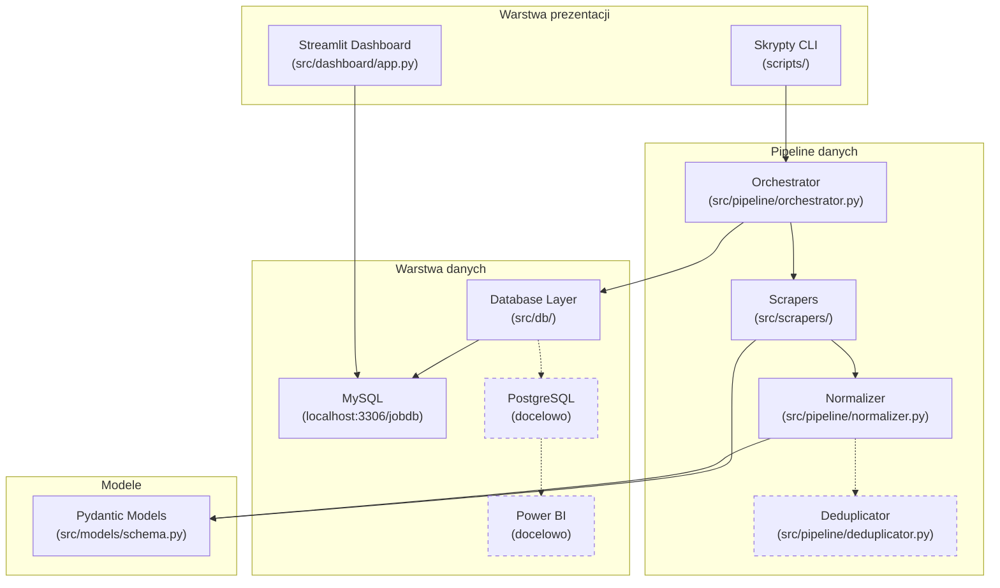
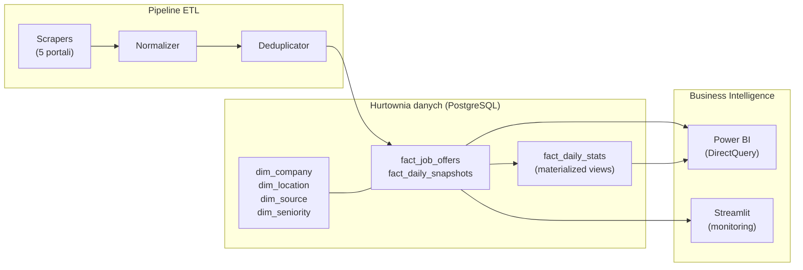
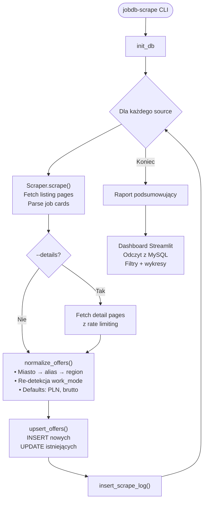

# Projekt systemu — jobDB

**jobDB** — tracker rynku pracy w stylu SteamDB dla polskich portali z ofertami pracy.
System scrapuje oferty, normalizuje dane, przechowuje je w MySQL i prezentuje na dashboardzie Streamlit.

**Docelowa architektura:** Migracja do PostgreSQL jako hurtownia danych (star schema) z podłączeniem Power BI.

---

## Architektura



> Linia przerywana przy Deduplicator = moduł zaimplementowany, ale niezintegrowany z pipeline.

---

## Stos technologiczny

| Warstwa | Technologie |
|---|---|
| Scraping | `httpx[http2]`, `selectolax` (HTML parsing), `playwright` (zainstalowany, nieużywany) |
| Modele danych | `pydantic` v2 (walidacja, computed fields) |
| Baza danych | `mysql-connector-python` (MySQL 8+) |
| Pipeline | `tenacity` (retry), `rapidfuzz` (fuzzy matching) |
| Dashboard | `streamlit`, `plotly`, `polars` |
| CLI / UX | `rich` (formatowanie terminala), `argparse` |
| Scheduler | `schedule` (zainstalowany, nieużywany) |
| Testy | `pytest`, `pytest-asyncio` |
| Linter | `ruff` (reguły E/F/I/N/W, max 120 znaków) |

---

## Moduły

### 1. Scrapers (`src/scrapers/`)

#### `base.py` — BaseScraper (klasa abstrakcyjna)

Bazowa klasa dla wszystkich scraperów z wbudowaną odpornością na błędy:

- **HTTP Client**: `httpx` z HTTP/2, timeout 30s
- **Retry**: Do 3 prób z wykładniczym backoffem (2–30s)
- **User-Agent Rotation**: Losowy nagłówek z puli 3 przeglądarek (Chrome/Firefox/Edge)
- **Rate Limiting**: Konfigurowalne opóźnienie per scraper z jitterem ×0.5–1.5
- **Metody abstrakcyjne**:
  - `scrape_listings(page)` → `list[JobOffer]` — parsowanie strony z listingiem
  - `scrape_detail(offer)` → `JobOffer` — opcjonalne wzbogacenie z podstrony
- **Metoda `scrape()`**: Pełna orkiestracja — iteracja po stronach, zbieranie ofert, obsługa błędów → `ScrapedResult`

#### `pracapl.py` — PracaPLScraper (praca.pl)

Jedyny w pełni zaimplementowany scraper:

**Parsowanie listingu:**
1. Selektor CSS: `ul.listing:not(.listing--week-offer) li.listing__item`
2. Fallback regex: `_(\d{7,10})\.html` na wszystkich linkach

**Ekstrakcja z karty oferty:**
- Tytuł + source_id → `<a class="listing__title">`
- Firma → `<a class="listing__employer-name">`
- Lokalizacja → `<span class="listing__location-name">` (oczyszczana z tekstu trybu pracy)
- Tryb pracy → `<span class="listing__work-model">` (zdalna→remote, hybrydow→hybrid, stacjonarn→onsite)
- Seniority → detekcja po słowach kluczowych (staż/praktyk→intern, junior, senior, lead, kierowni→manager, specjalist→mid)
- Wynagrodzenie → `_parse_salary(text)`

**Parser wynagrodzeń (`_parse_salary`):**
- Obsługuje formaty polskie: `"12 500 - 14 500 zł brutto/mies"`, `"30-45 €/godz"`
- Spacje w tysiącach, przecinki jako separator dziesiętny, NBSP
- Detekcja waluty: PLN (domyślna), EUR (€), USD ($), GBP (£), CHF
- Detekcja okresu: /mies→month, /godz→hour, /dzień→day, /rok→year
- Detekcja typu: brutto (domyślny) / netto (+ "na rękę")

**Wzbogacenie z podstrony (opcjonalne):**
- Pełny opis ogłoszenia
- Uzupełnienie firmy/lokalizacji jeśli brakuje na listing

**Rejestr scraperów:**
```python
SCRAPER_REGISTRY = {Source.PRACAPL: PracaPLScraper}
```

---

### 2. Pipeline (`src/pipeline/`)

#### `orchestrator.py` — główny przepływ

```
run_pipeline(sources, max_pages, fetch_details) → None
```

**Kroki:**
1. Inicjalizacja bazy (`init_db()`)
2. Dla każdego źródła:
   - Instancja scrapera z rejestru → `scraper.scrape()` → `ScrapedResult`
   - (Opcjonalnie) Fetch detail pages z rate limitingiem
   - Normalizacja → `normalize_offers(offers)`
   - Zapis → `upsert_offers(offers)` (INSERT nowych / UPDATE istniejących)
   - Log → `insert_scrape_log(entry)`
3. Wydruk raportu podsumowującego

**Run ID:** UUID (pierwsze 12 znaków) wiążące powiązane uruchomienia.

#### `normalizer.py` — normalizacja danych

- **Miasta**: 50+ aliasów polskich miast (warsaw→Warszawa, krakow→Kraków, zdalna→Remote)
- **Regiony**: Mapowanie miasto → województwo (Warszawa→mazowieckie, Kraków→małopolskie)
- **Tryb pracy**: Ponowna detekcja jeśli UNKNOWN — szukanie w title + location_raw + description
- **Tytuł/firma**: Kolaps wielokrotnych spacji
- **Wynagrodzenie**: Domyślna waluta PLN, domyślny typ brutto

#### `deduplicator.py` — deduplikacja ofert

- **Klucz prefiltracji**: MD5 hash `company_name|location_city` (pierwsze 10 znaków)
- **Sprawdzenie duplikatu** (`are_duplicates()`):
  - Różne źródła ✓
  - Fuzzy match firmy ≥ 70% (`rapidfuzz`)
  - Identyczne miasto
  - Podobieństwo tytułu (token-sort) ≥ 85%
- **Klasteryzacja**: Przypisanie `dedup_cluster_id` do dopasowanych ofert

> ⚠️ **Status: Zaimplementowany, ale NIE zintegrowany z pipeline.**

---

### 3. Baza danych (`src/db/`)

#### `database.py` — zarządzanie połączeniem

- Singleton connection do MySQL (`localhost:3306/jobdb`)
- `get_connection()` / `close_connection()`

#### `migrations.py` — DDL

- `init_db()` — tworzy 4 tabele (idempotentne `CREATE TABLE IF NOT EXISTS`)
- `drop_all()` — kasuje wszystkie tabele (reset/testy)

#### `queries.py` — operacje na danych

| Funkcja | Opis |
|---|---|
| `upsert_offers(offers)` | INSERT nowych / UPDATE istniejących ofert → `(new_count, updated_count)` |
| `mark_inactive(source, active_ids)` | Oznacza oferty niewidoczne w tym uruchomieniu jako `is_active = false` |
| `insert_scrape_log(entry)` | Wstawia wpis do `scrape_log` |
| `create_daily_snapshot(date)` | Tworzy snapshot aktywnych ofert do `job_snapshots` |
| `get_offer_count(source?)` | Zlicza oferty (opcjonalnie per źródło) |
| `get_stats_summary()` | Podsumowanie: total / active / with_salary / sources / cities |

---

### 4. Modele danych (`src/models/schema.py`)

Modele Pydantic v2 z walidacją i computed fields:

| Model | Opis |
|---|---|
| `JobOffer` | Oferta pracy — 22 pola + computed `id` (SHA256) |
| `ScrapedResult` | Wynik uruchomienia scrapera — oferty + metryki |
| `ScrapeLogEntry` | Wpis do logu scrapowania |

Enumy: `Source`, `WorkMode`, `Seniority`, `SalaryPeriod`, `ScrapeStatus`

→ Szczegółowy opis w [DATABASE_SCHEMA.md](DATABASE_SCHEMA.md#wartości-dozwolone-enumy)

---

### 5. Dashboard (`src/dashboard/app.py`)

Framework: **Streamlit** + **Plotly** + **Polars** (read-only na MySQL)

**Filtry (sidebar):**
- Multi-select: Źródło, Miasto, Tryb pracy, Seniority
- Wyświetlanie: Timestamp ostatniego scrapowania

**Sekcje główne:**

| Sekcja | Zawartość |
|---|---|
| KPI (4 metryki) | Aktywne oferty, z wynagrodzeniem, firmy, miasta |
| Top 15 miast | Wykres słupkowy horyzontalny |
| Tryb pracy | Wykres donut |
| Seniority | Wykres słupkowy |
| Typ zatrudnienia | Wykres donut |
| Oferty wg źródła | Tabela z pokryciem wynagrodzeń |
| Top 20 firm | Tabela: liczba ofert, miasta, dominujący tryb pracy |
| Lista ofert | Tabela (max 200), filtrowanie po tytule, linki do źródeł |
| Log scrapowania | 20 ostatnich uruchomień |

Wszystkie dane respektują aktywne filtry (dynamiczne WHERE).

---

### 6. Konfiguracja (`config/settings.py`)

```python
MYSQL_CONFIG = {
    "host": "localhost",
    "port": 3306,
    "user": "root",
    "password": "root",
    "database": "jobdb",
}
EXPORTS_DIR = "data/exports"

DEFAULT_DELAY_SECONDS = 2.0
MAX_RETRIES = 3
REQUEST_TIMEOUT = 30
```

**Zdefiniowane źródła (5):**

| Klucz | Portal | Base URL | Delay |
|---|---|---|---|
| `pracapl` | praca.pl | `https://www.praca.pl` | 2.0s |
| `justjoinit` | justjoin.it | `https://justjoin.it` | 1.5s |
| `rocketjobs` | rocketjobs.pl | `https://rocketjobs.pl` | 1.5s |
| `pracuj` | pracuj.pl | `https://www.pracuj.pl` | 3.0s |
| `jooble` | jooble.org | `https://pl.jooble.org` | 2.5s |

---

### 7. Skrypty CLI (`scripts/`)

| Skrypt | Entry Point | Opis |
|---|---|---|
| `run_scraper.py` | `jobdb-scrape` | Główny CLI — `-s` źródła, `-p` max stron, `-d` detale |
| `check_scraped_data.py` | — | Podsumowanie danych: counts, dystrybucje, statystyki salary |
| `verify_data.py` | — | Szybka weryfikacja kompletności danych |
| `debug_html.py` | — | Inspekcja HTML — klasy CSS, struktury ofert |

---

### 8. Testy (`tests/`)

**`test_salary_parsing.py`** — 26 test cases pytest:
- Formaty zakresowe: `"12 500 - 14 500 zł brutto/mies"`, `"4500-6000 zł"`
- Pojedyncze wartości: `"5 100 zł brutto/mies"`
- Godzinowe/dzienne/roczne: `"30-45 €/godz"`, `"350 zł brutto/dzień"`
- Multi-waluta: PLN, EUR (€), USD ($), GBP (£), CHF
- Edge cases: NBSP, B2B, decimals z przecinkami
- Wartości w złożonym tekście: `"pracownik fizyczny · umowa zlecenie · 12 500 - 14 500 zł..."`
- Nieprawidłowe dane: `None`, `""`, tekst bez salary

Status: **Wszystkie testy przechodzą ✅**

### 9. Agent progress-tracker (`.github/agents/progress-tracker.agent.md`)

Agent VS Code (Copilot) do weryfikacji i aktualizacji postępu prac:
- Porównuje deklarowany status w `docs/TODO.md` z faktycznym stanem kodu
- Uruchamia testy i sprawdza pokrycie
- Generuje raporty postępu z paskami procentowymi
- Wykrywa rozbieżności między dokumentacją a implementacją

### 10. Dashboard — zakładka Postęp prac (`src/dashboard/pages/2_📋_Postep_prac.py`)

Streamlit multi-page z:
- **Paski postępu** — ogólny + per priorytet (P1–P5) z rozwijalnymi listami zadań
- **Tabela statusu komponentów** — 25 komponentów z lokalizacją plików
- **Roadmapa** — interaktywny wykres Gantta (Plotly) z harmonogramem prac
- **Dokumentacja** — 3 zakładki: schemat DB, projekt systemu, TODO (renderowane z plików `.md`)

---

## Docelowa architektura hurtowni danych



**Star schema** — tabela faktów `fact_job_offers` połączona z wymiarami (company, location, source, seniority, work_mode). Partycjonowanie po `scraped_at` (monthly). Indeksy GIN na `technologies`, B-tree na klucze filtrów.

---

## Przepływ danych end-to-end



---

## Struktura projektu

```
jobDB/
├── .github/
│   └── agents/
│       ├── data-verifier.agent.md   # Agent weryfikacji danych
│       └── progress-tracker.agent.md # Agent śledzenia postępu
├── config/
│   └── settings.py              # Konfiguracja: DB, źródła, delays, User-Agents
├── data/
│   └── debug_praca.html         # Testowy HTML praca.pl
├── docs/
│   ├── DATABASE_SCHEMA.md       # Schemat bazy danych
│   ├── PROJECT_DESIGN.md        # Ten plik
│   └── TODO.md                  # Lista rzeczy do zrobienia
├── scripts/
│   ├── run_scraper.py           # CLI: uruchomienie scrapowania
│   ├── check_scraped_data.py    # Podsumowanie zescrapowanych danych
│   ├── verify_data.py           # Weryfikacja kompletności
│   └── debug_html.py            # Debugowanie HTML
├── src/
│   ├── analysis/                # [PUSTY] Moduł analityczny
│   ├── dashboard/
│   │   ├── app.py               # Dashboard Streamlit
│   │   └── pages/
│   │       └── 2_📋_Postep_prac.py  # Zakładka postępu prac
│   ├── db/
│   │   ├── database.py          # Singleton MySQL connection
│   │   ├── migrations.py        # DDL: CREATE/DROP tabel
│   │   └── queries.py           # Operacje: upsert, log, snapshot
│   ├── models/
│   │   └── schema.py            # Modele Pydantic + enumy
│   ├── pipeline/
│   │   ├── orchestrator.py      # Główny przepływ pipeline
│   │   ├── normalizer.py        # Normalizacja danych
│   │   └── deduplicator.py      # Deduplikacja (niezintegrowany)
│   └── scrapers/
│       ├── base.py              # BaseScraper (klasa abstrakcyjna)
│       └── pracapl.py           # Scraper praca.pl
├── tests/
│   └── test_scrapers/
│       └── test_salary_parsing.py  # 26 testów parsowania salary
└── pyproject.toml               # Zależności, entry points, ruff config
```
